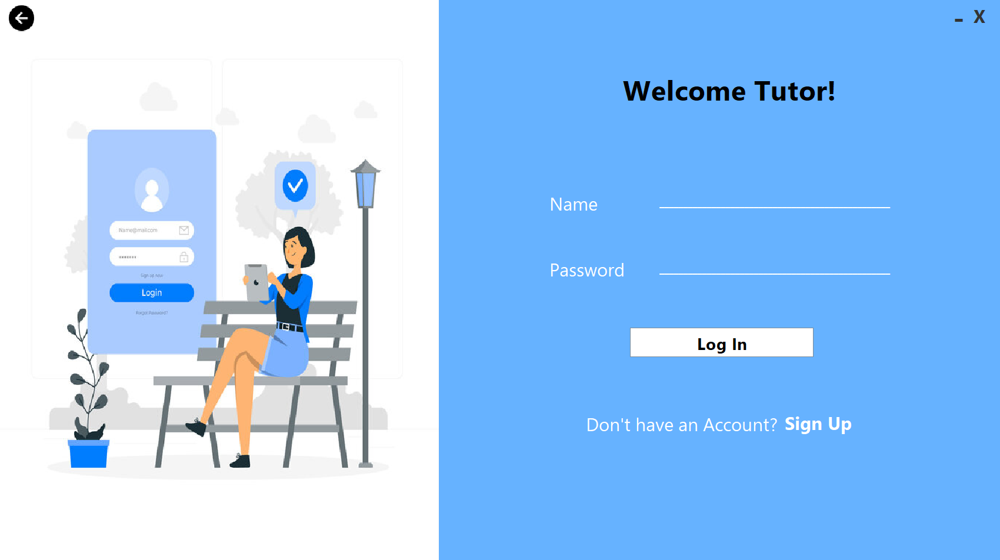
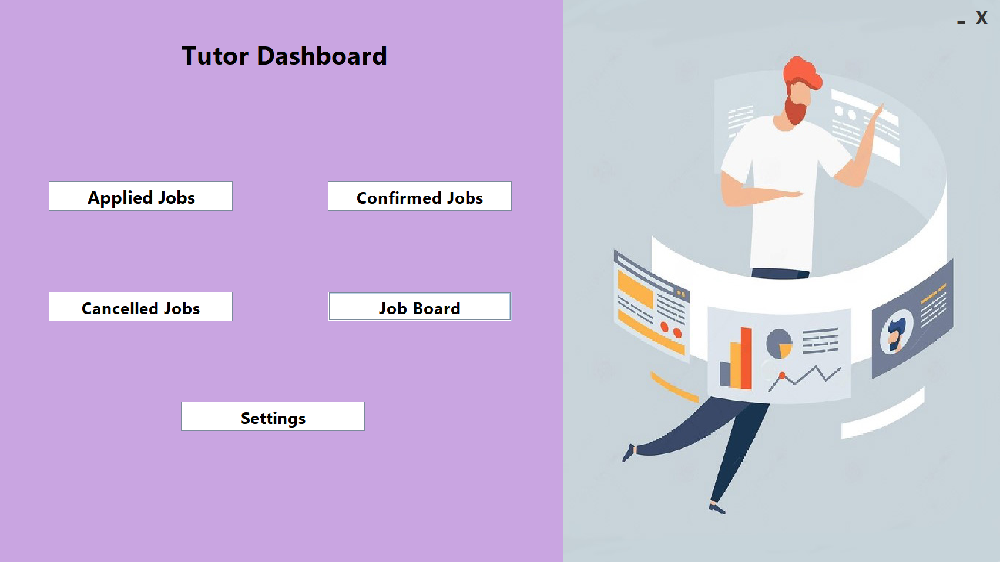
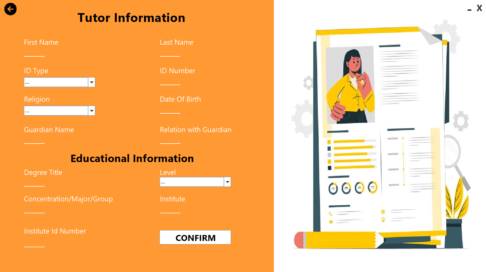
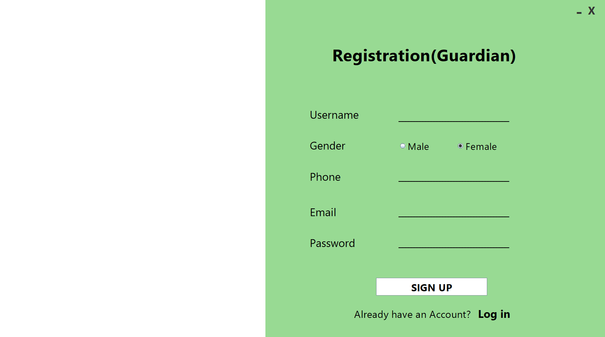
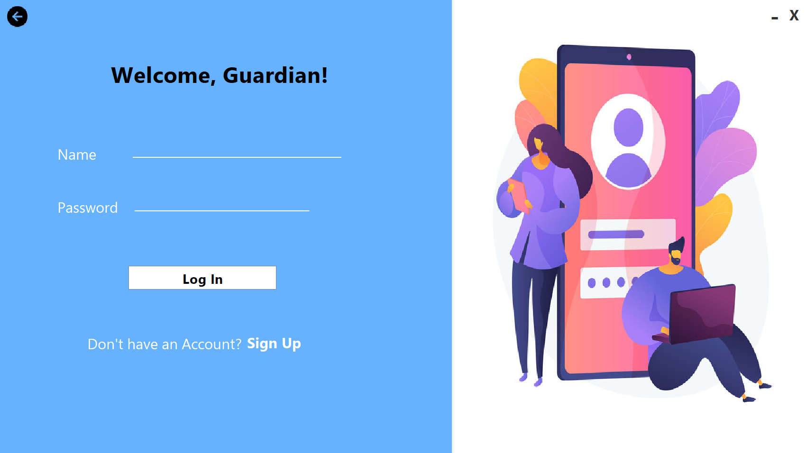
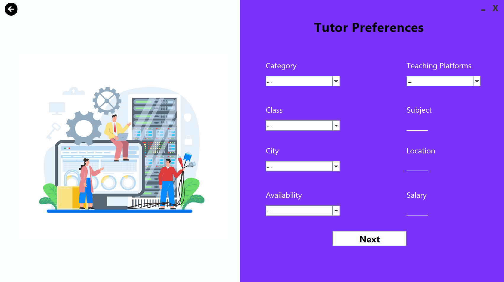
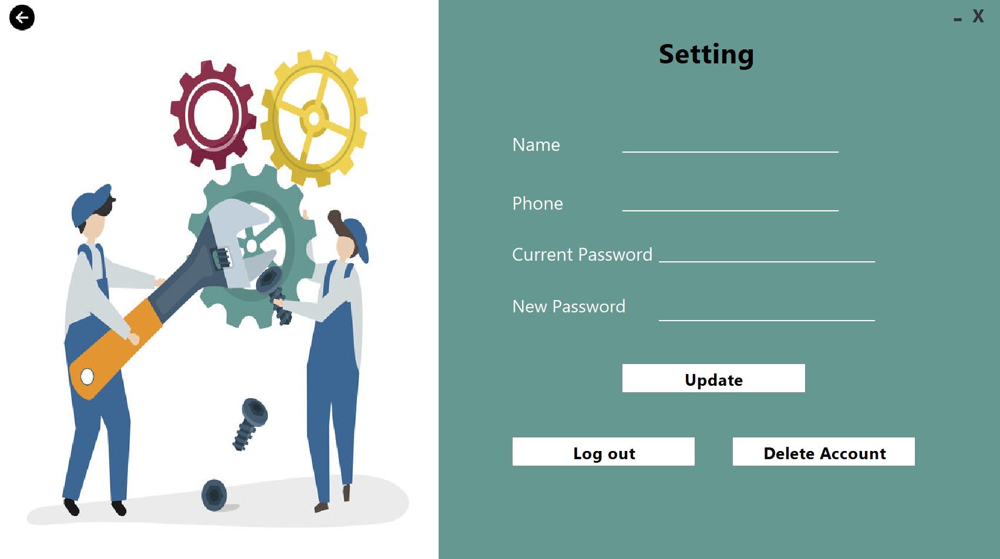
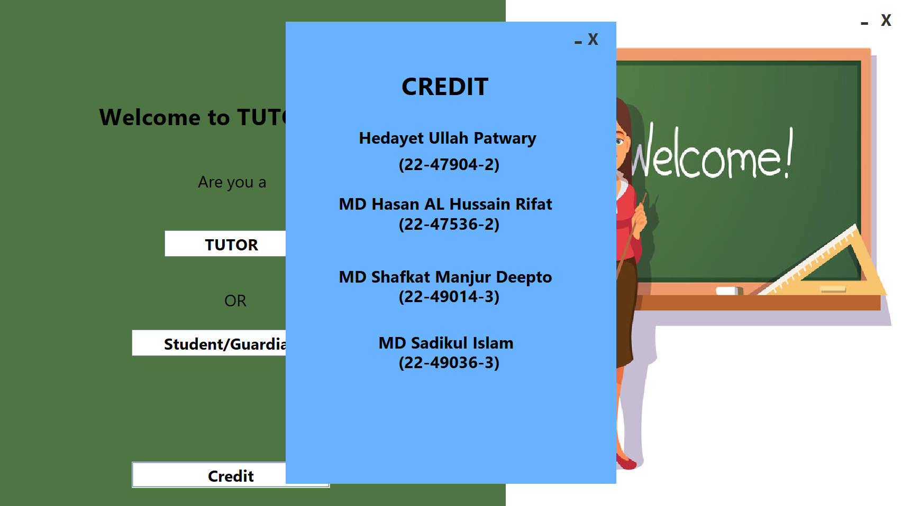

# TutorSheba — Tutor Management System

<p align="center">
  
</p>

**TutorSheba** is a Java-based Desktop GUI application designed to connect **Guardians** with qualified **Tutors**. The system streamlines the process of tutor discovery, registration, and preference management through a clean and intuitive graphical interface built with Java Swing.

---

## 📌 Table of Contents

- [Features](#-features)
- [Tech Stack](#-tech-stack)
- [Project Structure](#-project-structure)
- [Application Flow](#-application-flow)
- [Screenshots](#-screenshots)
- [How to Run](#-how-to-run)
- [Credits](#-credits)

---

## ✨ Features

- **Dual Role System** — Separate portals for Tutors and Guardians
- **Tutor Registration & Login** — Tutors can create accounts and securely log in
- **Guardian Registration & Login** — Guardians can register and log in independently
- **Tutor Profile Management** — Tutors can fill in and update detailed profile information
- **Tutor Preference Form** — Guardians can specify subject, location, and teaching preferences
- **Tutor Information Viewer** — Guardians can browse and view tutor details
- **Settings Panel** — Both Tutors and Guardians can update account settings
- **Credits Screen** — Developer acknowledgement page
- **File-based Data Storage** — User data is stored locally via `.txt` files (`Gdata.txt`, `Tdata.txt`, `tprefdata.txt`)

---

## 🛠 Tech Stack

| Technology | Usage |
|---|---|
| Java (JDK 8+) | Core programming language |
| Java Swing | GUI framework |
| AWT | Layout and event handling |
| File I/O | Local data persistence |

---

## 📁 Project Structure

```
TutorSheba-Java-GUI-Management/
│
├── Start.java                  # Entry point — launches the welcome screen
│
├── Classes/
│   ├── welcome.java            # Entry/Landing page frame
│   ├── tlogin.java             # Tutor login frame
│   ├── tsignup.java            # Tutor registration frame
│   ├── tdash.java              # Tutor dashboard frame
│   ├── tinfo.java              # Tutor profile information frame
│   ├── tsetting.java           # Tutor settings frame
│   ├── tprf.java               # Tutor profile view frame
│   ├── Glogin.java             # Guardian login frame
│   ├── Gsignup.java            # Guardian registration frame
│   ├── Gdash.java              # Guardian dashboard frame
│   ├── preference.java         # Guardian tutor-preference form frame
│   ├── gsetting.java           # Guardian settings frame
│   ├── credit.java             # Credits/About frame
│   ├── taccount.java           # Tutor account data handler
│   └── gaccount.java           # Guardian account data handler
│
├── Tdata.txt                   # Tutor account data storage
├── Gdata.txt                   # Guardian account data storage
├── tprefdata.txt               # Tutor preference data storage
│
└── screenshots/                # UI screenshots
```

---

## 🔄 Application Flow

The application follows a clear sequential flow for both user types:

### 👨‍👩‍👧 Guardian Flow
```
Entry Page
   └──▶ Guardian Login / Register
              └──▶ Guardian Dashboard
                        ├──▶ Tutor Preference Form  (specify requirements)
                        ├──▶ Tutor Information      (browse tutor profiles)
                        └──▶ Settings               (update account info)
```

### 👨‍🏫 Tutor Flow
```
Entry Page
   └──▶ Tutor Login / Register
              └──▶ Tutor Dashboard
                        ├──▶ Tutor Info Form        (fill profile details)
                        └──▶ Settings               (update account info)
```

---

## 📸 Screenshots

### 1. Entry Page
> The welcome/landing screen where users choose to continue as a Tutor or Guardian.

<p align="center">
  
</p>

---

### 2. Tutor Registration
> New tutors can create an account by providing their credentials.

<p align="center">
  
</p>

---

### 3. Tutor Login
> Registered tutors can securely log in to their account.

<p align="center">
  
</p>

---

### 4. Tutor Dashboard
> The main control panel for tutors after login.

<p align="center">
  
</p>

---

### 5. Tutor Info Form
> Tutors fill in detailed profile information such as subjects, location, and experience.

<p align="center">
  
</p>

---

### 6. Guardian Registration
> Guardians can register to search and connect with tutors.

<p align="center">
  
</p>

---

### 7. Guardian Login
> Registered guardians log in to access the system.

<p align="center">
  
</p>

---

### 8. Tutor Preference Form
> Guardians specify their requirements — subject, area, medium, and other preferences.

<p align="center">
  
</p>

---

### 9. Settings
> Both Tutors and Guardians can update their account settings from here.

<p align="center">
  
</p>

---

### 10. Credits
> Developer acknowledgement and project credits.

<p align="center">
  
</p>

---

## ▶ How to Run

### Prerequisites
- Java JDK 8 or higher installed
- Any Java IDE (IntelliJ IDEA, Eclipse, NetBeans) or command line

### Steps

**Using Command Line:**

```bash
# Clone the repository
git clone https://github.com/hedayet-ullah-patwary/TutorSheba-Java-GUI-Management.git

# Navigate to the project folder
cd TutorSheba-Java-GUI-Management

# Compile all Java files
javac -d . Classes/*.java Start.java

# Run the application
java Start
```

**Using an IDE:**
1. Open the project folder in your IDE
2. Set `Start.java` as the main class
3. Run the project

> ⚠️ Make sure `Images/` folder and `.txt` data files are in the root directory for the app to function correctly.

---

## 👨‍💻 Credits

Developed with ❤️ as a Java GUI Desktop Application project.

See the in-app **Credits** screen for full developer information.

---

## 📄 License

This project is for educational purposes. Feel free to fork and build upon it.
